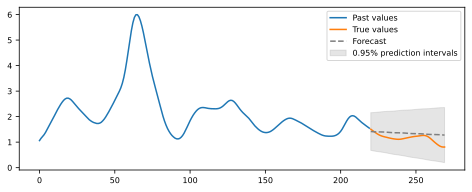
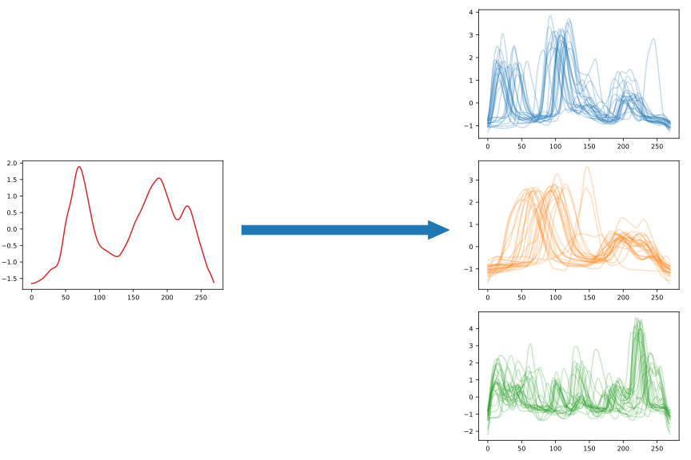
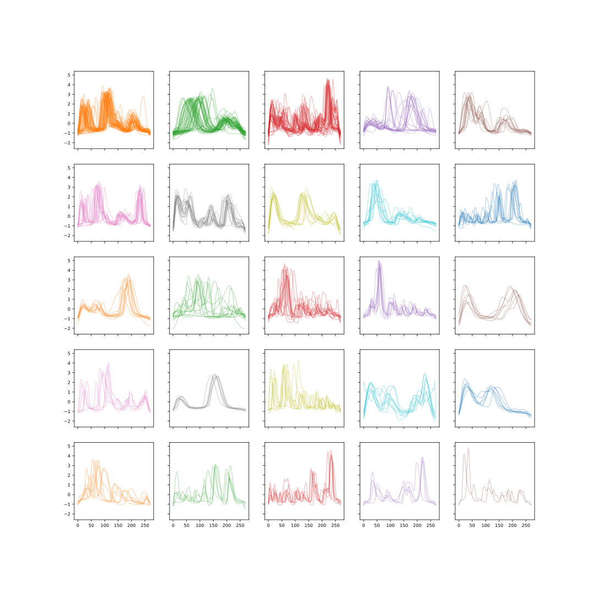
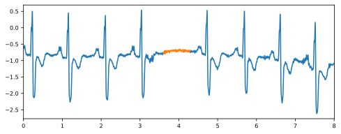
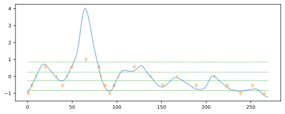
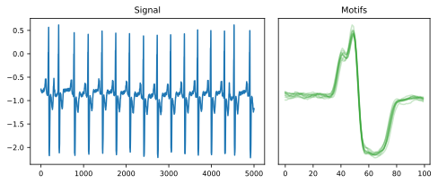
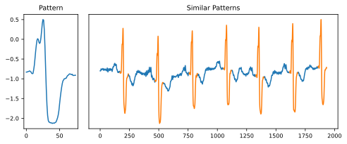
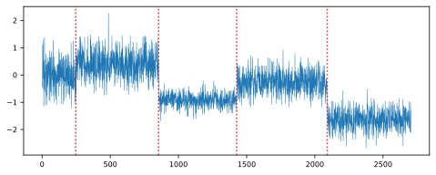

# Overview of time series analysis Python packages

## Motivation
This work was first published in [Siebert2021](#citation.siebert2021). This page presents the motivation and context behind the article.
The (hopefully updated) [overview](overview.html) of python packages dedicated to time series analysis can be found by following this [link](overview.html).

The original goal of the paper was to answer the following research questions:
 * Which time series analysis tasks exist? and which of these are implemented in (maintained) Python packages?
 * How do the packages support the evaluation of the produced results?
 * How do the packages support their usage, and what insights can we gain to estimate the durability of a given package and make an informed choice about its long-term use?

## Inclusion criteria

To guide our review and filter relevant packages, we defined the following inclusion criteria (IC):
 * IC1: The package should be open source, written in Python, available on GitHub (IC1). 
 * IC2.1: The package should be actively maintained (last commit in less than 6 months) (IC2.1);
 * IC2.2: it should have more than 100 GitHub stars (IC2.2); 
 * IC2.3: it should be listed in PyPI5 and be installable via pip or conda (IC2.3). 
 * IC3: The package should target explicitly time series analysis (IC3). We exclude packages that can be used for time series analysis (as building blocks) main purpose is not  time series analysis per se (for example, generic scientific computing packages such as scipy or numpy, packages dedicated to data manipulation or storage such as pandas, or generic machine learning or data mining packages such as scikit-learn). 
 * IC4: Finally, we focused our search on packages offering methods that tend to be domain agnostic (IC4) and exclude domain specific packages. Domain specific packages are packages aiming to solve time series analysis in a specific domain (for example, audio, finance, geoscience, etc.). They usually focus on specific types and formats of time series and domain related analysis tasks.

## Categories definitions:
The search process in [Siebert2021](#citation.siebert2021), led us (the authors) to use the some categories (we hope to update them over time).

### Tasks:

####  T1 (forecasting)
Forecasting (also called prediction) is the task of predicting future values of a time series given some past data. 
This is probably the most known and used task and there are many examples of forecasting applications. 
Sales, product price, or stock option prediction are typical examples from the field of finance.

<figure>
  
  <figcaption style="text-align: center;">Forecasting</figcaption>
</figure>

####  T2 (classification)
Classification is the task of assigning time series to predefined groups (called classes).

<figure>
  
  <figcaption style="text-align: center;">Classification</figcaption>
</figure>

####  T3 (clustering)
Clustering is the task of grouping similar time series into groups (called clusters). 
The difference between clustering and classification is that in classification the groups are predefined, 
whereas in clustering the groups are formed on the basis of the statistical properties of the data itself. 

<figure>
  
  <figcaption style="text-align: center;">Clustering</figcaption>
</figure>

####  T4 (anomaly detection)

Anomaly detection (also called outliers or novelty detection) is the task of finding abnormal data points (called outliers)
or subsequences (called discords).  

<figure>
  
  <figcaption style="text-align: center;">Anomaly detection</figcaption>
</figure>

####  T5 (segmentation)
Segmentation (also called summarization) is the task of creating an accurate approximation of a time series, 
by reducing its dimensionality while retaining its essential features. 

<figure>
  
  <figcaption style="text-align: center;">Segmentation (here SAX)</figcaption>
</figure>

####  T6 (pattern recognition)
Pattern recognition (also called motif discovery) is the task of finding time series subsequences that appears recurrently. 

<figure>
  
  <figcaption style="text-align: center;">Motifs discovery</figcaption>
</figure>

Not to be confused with **indexing**. Indexing (also called query by content) is the task of finding similar time series 
(or a given pattern or a subsequence of a time series) in a database. 
Searching for similar time series is the basis for other related tasks (such as clustering or motifs discovery, for instance). 

<figure>
  
  <figcaption style="text-align: center;">Indexing</figcaption>
</figure>

####  T7 (change point detection)
Change point detection is the task of finding points in time, where the statistical properties of the time series (like mean, variance)
abruptly change. Change point detection tests are often used in manufacturing for quality control.

<figure>
  
  <figcaption style="text-align: center;">Change point detection</figcaption>
</figure>

### Data preparation (also called implementation components in [Elsing2012](#citation.esling2012)):
####  DP1 (dimensionality reduction),
####  DP2 (missing values imputation),
####  DP3 (decomposition),
####  DP4 (preprocessing),
####  DP5 (similarity measures).
### Evaluation:
####  E1 (model selection, hyperparameters search, features selection),
####  E2 (metrics and statistical tests),
####  E3 (visualization).
### Datasets:
####  D1 (synthetic data generation),
####  and D2 (contains datasets).
### Documentation:
####  Do1 (dedicated documentation),
####  Do2 (notebook: directly executable (2), present (1)),
####  Do3 (API reference),
####  Do4 (install guide),
####  Do5 (user guide)

## References
<a name="citation.siebert2021">1.</a> Julien Siebert, Janek Groß, Christof Schroth. A systematic review of Python packages for time series analysis. [https://arxiv.org/abs/2104.07406](https://arxiv.org/abs/2104.07406)

<a name="citation.esling2012">2.</a> Esling, P., Agon, C.: Time-series data mining. ACM Computing Surveys 45(1), 1{34 (2012). https://doi.org/10.1145/2379776.2379788

<a name="citation.fakhrazari2017">3.</a> Fakhrazari, A., Vakilzadian, H.: A survey on time series data mining. In: 2017 IEEE International Conference on Electro Information Technology (EIT). pp. 476{481. IEEE (5/14/2017 - 5/17/2017). https://doi.org/10.1109/EIT.2017.8053409

<a name="citation.fu2011">4.</a> Fu, T.c.: A review on time series data mining. Engineering Applications of Artificial Intelligence 24(1), 164{181 (2011). https://doi.org/10.1016/j.engappai.2010.09.007

<a name="citation.keogh2003">5.</a> Keogh, E., Kasetty, S.: On the Need for Time Series Data Mining Benchmarks: A Survey and Empirical Demonstration (2003)

